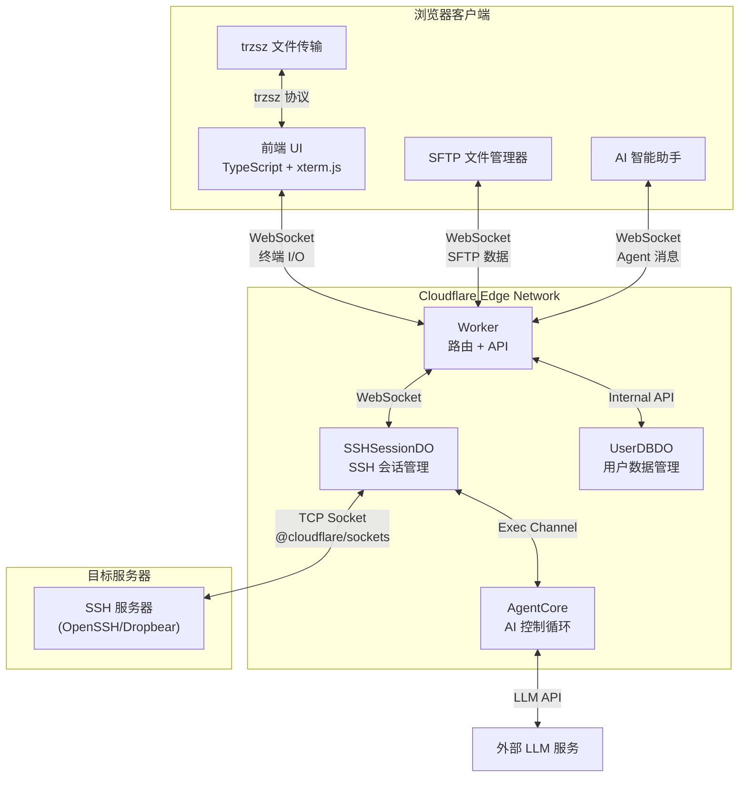

<div align="center">
  
  <p>一个基于 Cloudflare Workers 的 Serverless Web SSH 终端：通过浏览器直接连接和管理你的服务器。</p>
  <p><b>极致轻量 · 开箱即用 · 赛博朋克 UI22</b></p>
  <p>
    <a href="https://github.com/newbietan/CloudSSH/stargazers"></a>
    <a href="LICENSE"></a>
    
    
    
  </p>
  <p>
    <a href="#highlights">核心优势</a> ·
    <a href="#features">功能特性</a> ·
    <a href="#quick-start">部署指南</a> ·
    <a href="#architecture">架构设计</a> ·
    <a href="CHANGELOG.md">更新日志</a> ·
    <a href="#contributors">贡献者</a> ·
    <a href="#license">开源协议</a>
  </p>
  <p>
    <a href="README.md">简体中文</a> |
    <a href="README_en.md">English</a>
  </p>
</div>

> [!TIP]
> **CloudSSH** 利用 Cloudflare Workers 的 TCP Sockets 支持，在边缘节点实现 SSH 协议的解析与转发，提供低延迟的 Web 终端体验。

## 效果演示

> 想象一下，随时随地打开浏览器，就能以极具科技感的赛博朋克 UI 连接你的服务器，无需安装任何 SSH 客户端。

<div align="center">
  <a href="https://www.bilibili.com/video/BV1UgMt6UEdF" target="_blank" title="点击播放视频">
    
    <br/>
    
  </a>
  <p><sub>视频时长 8:27 · 演示 CloudSSH 完整使用流程</sub></p>
</div>

## 目录

- [核心优势](#highlights)
- [核心特性](#features)
- [架构说明](#architecture)
- [快速部署](#quick-start)
  - [GitHub 绑定自动部署](#方式一通过-github-绑定自动部署推荐)
    - [自动同步上游版本](#可选自动同步上游版本)
  - [本地命令行部署](#方式二本地命令行部署)
  - [配置 Turnstile](#可选配置-turnstile-人机验证)
  - [配置 GitHub OAuth](#可选配置-github-oauth-登录与服务器管理)
- [开发说明](#development)
  - [本地开发](#本地开发)
  - [技术栈](#技术栈)
- [贡献者](#contributors)
- [开源协议](#license)

<a id="highlights"></a>

## 核心优势

### 极致 Serverless

- **零服务器成本**：纯前端部署 + Cloudflare Workers，无需自建后端服务器。
- **边缘加速**：得益于 Cloudflare 的全球边缘网络，随时随地享受低延迟的 SSH 连接。

### 开箱即用

- **一键部署**：仅需Fork本仓库，再在 Cloudflare Dashboard 点击几下即可完成项目构建与部署。
- **现代化前端技术栈**：TypeScript + Vite + Tailwind CSS，配合 xterm.js 提供丝滑的终端体验。

### 安全可靠

- **分段加密传输**：浏览器与 Cloudflare Worker 之间使用 HTTPS/WSS，Worker 与目标主机之间使用完整的 SSH-2.0 协议；SSH 段支持 Curve25519-SHA256（优先）和 ECDH-NISTP256 密钥交换、AES-256-GCM（优先）/ AES-128-GCM / AES-256-CTR 数据加密，以及 HMAC-SHA2-256/512 完整性校验。
- **多算法主机密钥验证**：支持 Ed25519、ECDSA P-256/P-384/P-521、RSA 签名验证，首次连接展示 SHA-256 指纹（TOFU 模式）。
- **安全加固体系**：内置针对 IPv6 与保留地址的 SSRF 防护；`/api/ssh` 使用有界的 Worker 实例内存限流进行流量削峰，连接授权仍由 Turnstile 或一次性连接令牌负责；已保存的服务器凭据在每用户 Durable Object SQLite 中使用 AES-256-GCM 加密存储。
- **人机验证**：支持 Cloudflare Turnstile 验证，防止恶意机器人滥用。
- **隔离的会话状态**：每个 SSH 终端会话由独立的 Cloudflare Durable Object 管理；浏览器侧 WebSocket 使用 Hibernation API 接入方式，但活动的 SSH 出站 TCP 连接会使该 Durable Object 在会话期间保持唤醒。
- **已保存凭据内部流转**：一键连接已保存服务器时，凭据由 UserDBDO 在服务端解密，并通过一次性连接令牌在 Worker 与 SSHSessionDO 之间传递；浏览器不会收到明文凭据。匿名连接或首次保存服务器时，用户输入仍会通过 HTTPS/WSS 发送到 Worker。

<a id="features"></a>

## 核心特性

- **纯 TypeScript SSH-2.0 实现**：完全自研的 SSH 协议栈，不依赖任何第三方 SSH 库，基于 Web Crypto API 实现全部加密操作。
- **多算法密钥交换**：支持 Curve25519-SHA256（优先）和 ECDH-NISTP256 两种 KEX 算法，适配各类 SSH 服务器（包括 Dropbear）。
- **IPv4/IPv6 双栈**：完整支持 IPv4 和 IPv6 地址连接，包括 IPv6 方括号格式自动处理。
- **多种认证方式**：支持标准 SSH 密码认证，以及 OpenSSH 格式的 Ed25519、ECDSA P-256/P-384/P-521 和 RSA 私钥认证；RSA 默认使用 RSA-SHA2-256/512，只有显式兼容配置才允许旧 `ssh-rsa` SHA-1。
- **防范中间人攻击 (TOFU)**：首次连接自动提取服务器 Host Key（SHA-256 指纹）并显示，支持 Ed25519/ECDSA/RSA 签名验证，并在本地及 API 持久化缓存已知主机指纹以防范二次连接的欺骗风险。
- **全功能极客终端**：基于 `@xterm/xterm` 与 `@xterm/addon-webgl` 硬件加速渲染引擎，保证海量日志输出顺滑不卡顿。
- **可靠的终端剪贴板交互**：鼠标完成终端选区后自动复制，右键可直接粘贴；触摸设备点击快捷键栏的复制按钮进入选择模式，拖动选择文本后再次点击完成复制，避免依赖不稳定的长按选区，粘贴则使用独立按钮。粘贴统一经过 xterm.js 原生输入管线，仅在远端应用启用 bracketed paste 模式时发送对应控制序列，并自动规范化换行，兼容 Vim 等交互式编辑器和普通 Shell。
- **移动端终端适配**：针对手机和平板提供动态可视高度、软键盘与安全区适配、iOS 中文输入法兼容、紧凑工具栏、一次性 Ctrl/Alt、Esc/Tab/方向键/Home/End/PgUp/PgDn 等快捷键，以及移动端全屏 Agent/SFTP 面板。用户可主动尝试“全屏横屏”；浏览器不支持方向锁定时会回退为手动旋转提示，不会强制改变桌面端布局。
- **个性化 UI**：Theme V2 系统提供 Standard Dark、Standard Light、Cyberpunk、Glacier、Gruvbox 五款内置主题。配套 [GitHub Pages 主题编辑器](https://newbietan.github.io/CloudSSH/)可实时调整颜色、形状、密度、字体、阴影、动效及按钮/输入框/卡片/标签页样式，并预览登录页、服务器列表、终端 + SFTP 和 AI Agent 面板。主题通过 JSON 文件导入、导出、备份与分享；登录用户在应用中导入后会同步到账号并可跨浏览器恢复，匿名用户仅保存在当前浏览器。
- **SFTP 图形化文件管理**：集成完整的 SFTP v3 文件传输协议，提供图形化文件浏览器界面。支持目录浏览、文件上传/下载、新建文件夹、文件重命名与删除等操作；支持普通单选、`Cmd/Ctrl` 切换选择、`Shift` 连选、全选，以及批量下载文件和批量删除。基于 SSH 子系统实现，与终端会话并行运行，互不干扰，支持下载队列及上传取消。
- **原生文件传输**：集成 [trzsz.js](https://github.com/trzsz/trzsz.js)，支持 `trz`（上传）/ `tsz`（下载）命令进行文件传输，兼容 tmux 会话。还支持拖拽文件到终端窗口直接上传、目录传输及断点续传等高级功能。（需远程服务器安装 [trzsz](https://trzsz.github.io/)）
- **GitHub OAuth 集成**：支持 GitHub 登录，用户可保存和管理常用 SSH 服务器，实现一键连接；服务器支持最多 10 个规范化标签，列表可按名称、主机地址、用户名即时搜索并按标签筛选，每页固定展示 9 张服务器卡片。
- **服务器系统自动识别**：登录用户首次连接尚未识别的已保存服务器时，CloudSSH 会在终端就绪后通过独立 SSH exec 通道读取 `/etc/os-release` 或 `uname`，并在服务器卡片显示对应系统图标。检测在后台执行，不阻塞终端；只有成功识别的结果才会保存，未识别结果会留待下次连接重新探测，修改主机地址或端口也会清除旧结果。匿名连接不执行该检测。该只读命令可能出现在目标服务器的 SSH 审计日志中。
- **IP 隐私展示与快捷复制**：服务器列表和连接状态栏会对有效 IPv4/IPv6 地址进行视觉掩码，减少演示或截图时意外暴露完整地址的风险；可通过鼠标点击或键盘操作复制用于连接的完整 IP。域名保持原样显示，视觉掩码不等同于加密或访问控制。
- **单页面多标签会话管理**：支持在单个页面内开启与切换多个独立的 SSH 终端与 SFTP 文件管理器，各会话环境和状态完全隔离，并在个性化主题编辑器中进行了联动适配。
- **安全匿名历史记录**：本地存储最近 5 条匿名连接，且敏感凭证可选使用本地派生的密钥进行 AES-256-GCM 安全加密存储至 `localStorage`，提供一键回填与清除。
- **双段延迟与 Colo 展示**：状态栏即时且周期性地展示当前 RTT（客户端至 Cloudflare）、物理延迟（Cloudflare 至主机）以及 Cloudflare 当前服务的数据中心代码（如 `CF-LAX`），并通过绿、黄、红三色状态点提示网络质量。
- **智能区域调度（locationHint）**：保存服务器时通过 IPinfo 查询目标主机的地理信息并持久化 DO 部署区域，连接时直接读取数据库，不再执行外部地理查询；查询失败时自动退化为 Cloudflare 默认调度，也可手动覆盖区域偏好。_注意：自动推断会把目标主机信息发送给第三方 IPinfo；locationHint 是 Cloudflare 的 best-effort 特性，当目标区域 DO 容量不足时会 fallback 到最近可用区域。_
- **终端文本检索**：支持使用快捷键 `Ctrl+Shift+F` 呼出搜索框，实时检索终端历史日志。
- **终端日志一键导出**：支持通过顶栏的下载按钮，将当前活跃会话终端的完整屏幕历史 buffer 一键导出并下载为 `.txt` 文本文件，解决长日志在浏览器下鼠标选取容易卡顿的痛点。
- **AI 智能助手**：内置 AI Agent 侧边栏，支持 BYOK（自带 API Key）接入 OpenAI 兼容接口（如 DeepSeek）。提供 8 个专业运维工具：执行命令、读取终端上下文、探测服务器环境、进程列表、systemctl 服务管理、Docker 容器管理、用户确认、结构化报告输出。选择终端内容后可在选区末端点击“询问 AI 助手”，将完整选区作为当前标签独立的待发送上下文附件；附件支持来源和行数展示、展开预览、替换与移除，只有用户补充问题后才会发送。终端选区会被明确标记为非可信分析数据，不代表操作授权，也不能覆盖用户指令。Agent 代码块支持一键复制，安全的 Shell 单行命令可填入当前终端且不会自动执行。支持 LLM 流式输出（逐字显示），危险命令自动拦截或通过默认拒绝的安全对话框确认。**思考过程容器**：多步骤任务执行时，实时预览最近 1-2 条命令，完成后自动折叠显示总步骤数，支持展开查看完整执行历史。
- **工程质量门禁**：GitHub Actions 在 `test` 与 `main` 分支部署前依次执行冻结锁文件安装、Worker/前端类型检查、单元与集成测试、可复现前端构建、Playwright 浏览器 E2E 和 axe 无障碍回归；任一环节失败都会阻止部署。

<a id="architecture"></a>

## 架构说明

### 系统架构



### 核心组件

| 组件                 | 文件                                                  | 职责                                                                                                                            |
| -------------------- | ----------------------------------------------------- | ------------------------------------------------------------------------------------------------------------------------------- |
| **Worker 入口**      | `src/worker/index.ts`                                 | HTTP 路由、API 处理、WebSocket 升级                                                                                             |
| **SSHSessionDO**     | `src/worker/durable-object.ts`                        | SSH 会话生命周期管理、SSRF 防护                                                                                                 |
| **UserDBDO**         | `src/worker/user-db.ts`                               | 按 GitHub 用户隔离的用户数据、Session、服务器配置、规范化标签与凭据存储（SQLite）                                               |
| **IP 地理推断**      | `src/worker/ip-geo.ts`                                | 保存服务器时推断目标 IP 所在区域，映射到 Cloudflare DO locationHint                                                             |
| **操作系统识别**     | `src/worker/os-detect.ts`                             | 解析远端系统标识、规范化可持久化 OS key                                                                                         |
| **SSHSession**       | `src/worker/ssh-session.ts`                           | SSH 协议状态机（连接→版本→密钥交换→认证→交互）                                                                                  |
| **SSH 协议栈**       | `src/ssh/*.ts`                                        | 纯 TypeScript SSH-2.0 实现（传输层、加密、认证、通道）                                                                          |
| **SFTP 处理器**      | `src/worker/sftp-handler.ts`                          | SFTP 协议操作、任务队列、并发下载、上传跟踪与取消支持                                                                           |
| **SFTP 协议实现**    | `src/ssh/sftp.ts` / `sftp-types.ts`                   | SFTP v3 协议客户端、包解析与类型定义                                                                                            |
| **前端终端**         | `frontend/src/terminal.ts`                            | xterm.js 封装、原生右键粘贴、实时双段延迟心跳、网络质量三色提示、终端搜索、选区询问 Agent 及 WebSocket 交互                     |
| **移动端控制器**     | `frontend/src/mobile-terminal.ts` / `mobile-input.ts` | 动态视口、iOS IME 补偿、触摸快捷键、剪贴板操作及可选全屏横屏                                                                    |
| **标签管理器**       | `frontend/src/tab-manager.ts`                         | 单页面多会话标签页管理器，协调不同标签页内的终端、SFTP 与 Agent 实例及上下文隔离，并展示可复制的掩码 IP                         |
| **服务器列表**       | `frontend/src/server-list.ts`                         | 服务器卡片管理、搜索、标签筛选、IP 隐私展示及每页 9 项分页                                                                      |
| **主机地址展示**     | `frontend/src/host-display.ts`                        | 校验 IPv4/IPv6 字面量并生成统一的隐私掩码文本                                                                                   |
| **SFTP 面板**        | `frontend/src/sftp-panel.ts`                          | 图形化文件管理器 UI，支持多选、批量下载/删除、上传下载队列和取消操作                                                            |
| **AI Agent**         | `src/worker/agent/core.ts`                            | AI 控制循环：LLM 流式调用、工具执行、环境探测、终端上下文读取                                                                   |
| **Agent 工具**       | `src/worker/agent/tools.ts`                           | 8 个运维工具定义（执行命令、终端上下文、环境探测、进程列表、服务管理、Docker 管理、用户确认、报告输出）                         |
| **Agent 安全**       | `src/worker/agent/safety.ts`                          | 两层安全策略：直接拦截（rm -rf /、fork bomb 等）+ 弹窗确认（rm、shutdown、iptables 等）                                         |
| **Agent 面板**       | `frontend/src/agent/agent-panel.ts`                   | AI 助手侧边栏 UI，支持终端选区上下文附件、流式输出、Markdown 渲染、代码块复制与安全填入终端、可折叠思考过程容器和安全确认对话框 |
| **Agent 选区上下文** | `frontend/src/agent/terminal-selection-context.ts`    | 保留终端选区快照、统计展示信息，并将用户问题与非授权安全边界组合为模型请求                                                      |
| **AI 配置**          | `frontend/src/ai-config.ts`                           | AI 模型配置弹窗，支持 Base URL / API Key / 模型选择                                                                             |
| **区域选项**         | `frontend/src/regions.ts`                             | DO locationHint 区域选项共享组件，供服务器管理和匿名连接表单共用                                                                |

### SSH 协议实现

本项目实现了完整的 SSH-2.0 协议栈：

| 层级           | 实现                                | 支持算法                                                      |
| -------------- | ----------------------------------- | ------------------------------------------------------------- |
| **密钥交换**   | `kex-curve25519.ts` / `kex-ecdh.ts` | curve25519-sha256, ecdh-sha2-nistp256                         |
| **数据加密**   | `crypto.ts`                         | aes256-gcm, aes128-gcm, aes256-ctr, aes192-ctr, aes128-ctr    |
| **完整性校验** | `crypto.ts`                         | hmac-sha2-256, hmac-sha2-512, hmac-sha1                       |
| **主机密钥**   | `ssh-session.ts`                    | Ed25519, ECDSA P-256/P-384/P-521, RSA                         |
| **用户认证**   | `auth.ts`                           | 密码认证；Ed25519、ECDSA P-256/P-384/P-521、RSA-SHA2 私钥认证 |
| **通道管理**   | `channel.ts`                        | session channel, SFTP subsystem, PTY, shell, window-change    |
| **SFTP 协议**  | `sftp.ts` / `sftp-types.ts`         | SFTP v3 文件传输协议（目录浏览、上传、下载、删除、重命名）    |

### 数据流

1. 用户在前端输入主机 IP、账号和密码（或通过 GitHub OAuth 选择已保存的服务器）。
2. 前端与后端的 Durable Object 建立 WebSocket 连接。
3. SSHSessionDO 接收凭据，使用 `@cloudflare/sockets` 与目标 SSH 服务器建立 TCP 连接。
4. SSHSession 执行完整的 SSH 协议协商（版本交换→密钥交换→认证→打开通道→PTY→Shell）。
5. 终端数据在浏览器与 Worker 之间通过 WSS 传输，在 Worker 与目标服务器之间通过 SSH 加密传输；Worker 负责两段协议之间的转发和 SSH 协议处理。
6. SFTP 文件管理通过独立的 SSH 子系统通道运行，支持目录浏览、文件上传/下载等操作。
7. 对尚无 OS 记录的已保存服务器，SSHSession 在 Shell 就绪后通过独立 exec 通道进行一次只读系统识别；成功结果写入 UserDBDO 并通知前端更新卡片，未知结果不保存。
8. AI 助手通过 WebSocket 接收用户问题及可选的终端选区上下文；选区被标记为非可信分析数据后交给 AgentCore，后者调用外部 LLM API，通过 SSH exec 通道执行获准的命令，并将结果流式返回前端。

<a id="quick-start"></a>

## 快速部署

### 前置要求

- 一个 Cloudflare 账号。
- 启用 Cloudflare Workers 免费计划（TCP Sockets 和 Durable Objects 功能需要）。

### 部署步骤

#### 方式一：通过 GitHub 绑定自动部署（推荐）

<div align="center">
  <a href="https://dash.cloudflare.com/?url=https://github.com/newbietan/CloudSSH">
    
  </a>
  <p>点击按钮跳转至 Cloudflare 控制台，授权 GitHub 后即可自动完成部署（无需本地环境）</p>
</div>

1. **Fork 本仓库** 到你的 GitHub 账号。
2. **创建 Worker 应用**：登录 Cloudflare，进入 Workers & Pages，点击创建应用，绑定你的 GitHub 账号，选择 Fork 的仓库。
3. **填写构建命令**：在部署设置中，将"构建命令"（Build command）填写为 `pnpm run build:frontend`，点击保存并部署。
4. **访问应用**：部署成功后，可通过默认域名 `https://cloudssh.<你的子域>.workers.dev` 访问。
5. **绑定自定义域名**（可选）：进入 Worker 的 Settings → Domains & Routes → Add，输入你的域名并确认。

> **说明**：如需部署 test 环境，可 Fork 后在 `test` 分支上重复上述步骤，创建独立的 Worker（如 `cloudssh-test`）。两个环境的 Durable Objects 数据完全隔离，各自独立。

##### 可选：自动同步上游版本

Fork 仓库可以通过内置的 `Sync upstream` GitHub Actions 工作流，定时将本项目 `main` 分支的最新版本同步到自己的 `main` 分支。该功能**默认关闭**，开启后每天北京时间 04:20 检查一次；同步产生的分支更新会由 Cloudflare Git 集成自动构建并部署，无需额外配置部署开关。

1. 确认 Cloudflare Worker 连接的是你自己的 Fork 仓库，且 Production branch 设置为 `main`，自动构建处于开启状态。
2. 进入 Fork 仓库的 **Actions** 页面并启用工作流。已有 Fork 如果尚未包含 `Sync upstream`，请先通过 GitHub 的 **Sync fork** 功能手动同步一次。
3. 进入 **Settings → Secrets and variables → Actions → Variables**，创建 Repository variable：
   - Name：`AUTO_SYNC_UPSTREAM`
   - Value：`true`
4. 如需立即同步，进入 **Actions → Sync upstream → Run workflow** 手动执行；手动执行不要求设置上述变量。

> **同步说明**：工作流使用 GitHub 提供的 Fork 同步接口，不需要 PAT，也不会强制覆盖分支。若你的 `main` 与上游存在无法自动合并的冲突，任务会失败并保留现有代码，需要手动解决冲突。建议不要直接修改部署用的 `main` 分支，并将域名、密钥及环境变量保存在 Cloudflare Dashboard 中。

#### 方式二：本地命令行部署

1. **克隆仓库**

   ```bash
   git clone https://github.com/newbietan/CloudSSH.git
   cd CloudSSH
   ```

2. **安装依赖**

   ```bash
   npm install -g pnpm
   pnpm install
   cd frontend && pnpm install
   ```

3. **登录 Cloudflare**

   ```bash
   npx wrangler login
   ```

4. **部署生产环境**

   ```bash
   pnpm run deploy
   ```

5. **部署测试环境**（可选）
   ```bash
   pnpm run deploy:test
   ```

> **说明**：两个环境的 Durable Objects 虽然绑定相同的 class_name，但因 Worker 名称不同，数据完全隔离。部署完成后可在 Cloudflare Dashboard 中分别绑定不同的自定义域名（Settings → Domains & Routes）。

#### 可选：配置 Turnstile 人机验证

为防止恶意机器人滥用，建议启用 Cloudflare Turnstile 验证：

1. **创建 Turnstile Widget**：登录 [Cloudflare Dashboard](https://dash.cloudflare.com/)，进入 Turnstile 页面创建一个新的 Widget。
2. **获取密钥**：创建后会获得一个 **Site Key**（公开）和一个 **Secret Key**（保密）。
3. **配置环境变量**：在 Cloudflare Dashboard 的 Workers 设置中，进入 "Settings" → "Variables and Secrets"，添加以下环境变量：
   - `TURNSTILE_SECRET` = 你的 Secret Key
   - `TURNSTILE_SITEKEY` = 你的 Site Key
4. **重新部署**：运行部署命令使配置生效。

> **环境变量类型建议**：建议将所有环境变量都设置为 **Secret** 类型。Secrets 存储在 Cloudflare 加密存储中，与代码部署分离，重新部署时不会被覆盖或丢失。在 Dashboard 添加变量时，选择 "Secret" 类型即可。

> **说明**：Turnstile 验证为会话级别，用户通过验证后当前会话内所有功能可用，关闭浏览器后需重新验证。

#### 可选：配置 GitHub OAuth 登录与服务器管理

启用 GitHub 登录后，用户可以通过 GitHub 账号登录，并在个人空间中保存和管理常用的 SSH 服务器，实现一键连接。不配置时，此功能自动隐藏，不影响匿名 SSH 连接的正常使用。

1. **创建 GitHub OAuth App**：
   - 登录 GitHub → Settings → Developer settings → OAuth Apps → [New OAuth App](https://github.com/settings/applications/new)
   - **Application name**：`CloudSSH`（自定义）
   - **Homepage URL**：`https://your-domain.com`（你的部署域名）
   - **Authorization callback URL**：`https://your-domain.com/api/auth/callback`
   - 创建后获得 **Client ID**，点击 **Generate a new client secret** 生成 **Client Secret**（仅显示一次，请立即保存）

2. **配置环境变量**：在 Cloudflare Dashboard 的 Workers 设置中，进入 "Settings" → "Variables and Secrets"，添加以下环境变量：
   - `GITHUB_CLIENT_ID` = 你的 Client ID
   - `BASE_URL` = `https://your-domain.com`（你的部署域名）
   - `GITHUB_CLIENT_SECRET` = 你的 Client Secret

3. **重新部署**：保存环境变量后重新部署当前 Worker。仓库中的 Durable Object migration 会负责初始化所需类和数据库，不需要删除已有 Worker。

> **环境变量类型建议**：建议将所有环境变量都设置为 **Secret** 类型。Secrets 存储在 Cloudflare 加密存储中，与代码部署分离，重新部署时不会被覆盖或丢失。在 Dashboard 添加变量时，选择 "Secret" 类型即可。

> **说明**：服务器凭据（密码/私钥）在每用户 UserDBDO SQLite 中使用 AES-256-GCM 加密存储。当前加密密钥在首次使用时自动生成，并与密文保存在同一个 Durable Object 数据库中。一键连接已保存服务器时，浏览器不会收到明文凭据，服务端通过一次性连接令牌完成内部传递。

<a id="development"></a>

## 开发说明

### 项目结构

本项目采用 pnpm monorepo 工作区结构：

```
CloudSSH/
├── src/                    # 后端源码 (Cloudflare Worker)
│   ├── ssh/                # SSH 协议纯实现层（传输、加密、认证、通道、SFTP）
│   └── worker/             # Worker 入口和 Durable Objects
│       └── agent/          # AI Agent 控制循环、工具、安全检测
├── frontend/               # 前端源码 (独立 workspace)
│   └── src/                # TypeScript + xterm.js + trzsz
│       └── agent/          # AI 助手侧边栏 UI
├── docs/                   # GitHub Pages 静态资源
│   └── theme-editor/       # 可视化主题编辑器
├── scripts/                # 构建脚本
├── tests/                  # Vitest、Playwright 与 axe 回归测试
├── .github/workflows/      # CI/CD 自动部署配置
├── pnpm-workspace.yaml     # pnpm 工作区配置
└── wrangler.toml           # Cloudflare 部署配置
```

### 本地开发

#### 环境准备

1. **Fork 并克隆仓库**

   ```bash
   git clone https://github.com/<你的用户名>/CloudSSH.git
   cd CloudSSH
   ```

2. **安装依赖**（需分别安装根目录和前端依赖）

   ```bash
   pnpm install
   cd frontend && pnpm install
   ```

3. **登录 Cloudflare**（首次需要，后续会缓存凭据）

   ```bash
   npx wrangler login
   ```

   > **说明**：本地开发使用 Wrangler Dev 时，会连接到你的 Cloudflare 账号以使用 Durable Objects 和 TCP Sockets。SSH 连接的真实 TCP 流量会通过 Cloudflare 的基础设施转发。

4. **配置 GitHub Actions**（可选，如需自动部署）

   如果你希望通过 GitHub Actions 自动部署到自己的 Cloudflare 账号，需要修改 `.github/workflows/deploy.yml` 中的仓库所有者名称：

   ```yaml
   if: github.repository_owner == '你的GitHub用户名'
   ```

   同时在仓库的 Settings → Secrets and variables → Actions 中配置以下 Secrets：
   - `CLOUDFLARE_API_TOKEN`：Cloudflare API Token
   - `CLOUDFLARE_ACCOUNT_ID`：Cloudflare 账号 ID

#### 启动开发服务器

```bash
pnpm run dev
```

此命令将构建前端并启动 Wrangler 本地开发环境，支持：

- 前端代码变更自动重新构建
- Worker 代码变更自动重新加载
- 完整的 Durable Objects 和 TCP Sockets 功能

开发服务器启动后，访问终端输出的本地地址（通常为 `http://localhost:8787`）即可进行调试。

#### 常用开发命令

| 命令                      | 说明                                         |
| ------------------------- | -------------------------------------------- |
| `pnpm run dev`            | 构建前端 + 启动 Wrangler 开发服务器          |
| `pnpm run build:frontend` | 仅构建前端（输出到 `frontend/dist/`）        |
| `pnpm run typecheck`      | 检查 Worker 与前端 TypeScript 类型           |
| `pnpm test`               | 运行 Vitest 单元与集成测试                   |
| `pnpm run test:e2e`       | 运行 Playwright 浏览器 E2E 与 axe 无障碍测试 |
| `pnpm run verify`         | 依次执行类型检查、测试、生产构建和浏览器 E2E |
| `pnpm run deploy:test`    | 构建并部署到隔离的测试环境                   |

#### 提交变更的流程

**禁止创建特性分支（feature branch）。** 所有变更必须直接提交到 `test` 分支，保持仓库分支结构整洁。

```
test 分支（开发/测试）  ──合并──>  main 分支（生产）
```

1. 切换到 `test` 分支：`git checkout test`
2. 拉取最新代码：`git pull origin test`
3. 进行开发并本地测试
4. 直接提交并推送：`git push origin test`
5. 测试通过后，维护者会将 `test` 分支合并到 `main` 分支

> **说明**：`main` 分支设置了保护规则，禁止直接推送。所有变更必须先提交到 `test` 分支进行测试。请勿创建 `feat/xxx`、`fix/xxx` 等特性分支，直接在 `test` 分支上提交即可。

### 技术栈

| 层级         | 技术                                                 | 说明                                                                                         |
| ------------ | ---------------------------------------------------- | -------------------------------------------------------------------------------------------- |
| **前端**     | TypeScript + Vite + xterm.js                         | Web 终端模拟器，WebGL 硬件加速                                                               |
| **UI 框架**  | Tailwind CSS（Vite/PostCSS 本地构建）+ Theme V2 系统 | 应用支持内置主题切换、自定义主题 JSON 导入及登录账号同步；主题编辑与导出由 GitHub Pages 提供 |
| **文件传输** | trzsz.js                                             | 支持 trz/tsz 命令、拖拽上传、断点续传                                                        |
| **AI 助手**  | BYOK + OpenAI 兼容接口                               | 自带 API Key，支持 DeepSeek 等兼容模型                                                       |
| **后端**     | Cloudflare Workers                                   | Serverless 边缘计算                                                                          |
| **会话管理** | Durable Objects                                      | SSH 会话隔离；浏览器 WebSocket 使用 Hibernation API 接入，活动出站 TCP 期间不休眠            |
| **数据存储** | Durable Objects SQLite                               | 用户数据、服务器配置                                                                         |
| **包管理**   | pnpm (workspace)                                     | Monorepo 依赖管理                                                                            |

<a id="contributors"></a>

## 贡献者

感谢以下贡献者对 CloudSSH 的代码、兼容性和用户体验所做的贡献：

| 贡献者                                              | 主要贡献                                                                                                                 |
| --------------------------------------------------- | ------------------------------------------------------------------------------------------------------------------------ |
| [TanXin (@newbietan)](https://github.com/newbietan) | 项目发起与持续维护；Cloudflare Serverless、SSH/SFTP、AI Agent、安全体系、主题系统及工程化建设                            |
| [David xu (@xqdoo00o)](https://github.com/xqdoo00o) | Dropbear 兼容、trzsz 文件传输迁移、PTY 尺寸处理，以及会话退出与重连交互优化                                              |
| [vonl1 (@vonl1)](https://github.com/vonl1)          | 终端选区自动复制、兼容 Vim 的右键粘贴体验、服务器 IPv4/IPv6 掩码与完整地址快捷复制，以及服务器操作系统自动识别与品牌图标 |

名单及贡献说明依据 Git 提交历史与已接收的 Pull Request 整理；同一贡献者在历史中可能使用过不同的 Git 作者名称或邮箱。完整记录请参阅 [GitHub Contributors](https://github.com/newbietan/CloudSSH/graphs/contributors)。欢迎通过 Issue 和 Pull Request 参与项目建设。

<a id="license"></a>

## 开源协议

本项目基于 [Apache License 2.0](LICENSE) 协议开源。

**原作者与署名要求**：CloudSSH 由 [TanXin (@newbietan)](https://github.com/newbietan) 发起并完成核心架构设计，目前仍由原作者持续维护。任何基于本项目的二次修改、衍生开发或再发布，均须保留 [LICENSE](LICENSE) 与 [NOTICE](NOTICE) 中的许可证、版权和归属声明，并在项目文档或其他随附声明中明确注明“本项目基于 CloudSSH 修改，原作者为 TanXin (@newbietan)”及原项目链接。

商业使用、修改与再分发均以 [Apache License 2.0](LICENSE) 的条款为准；上述署名要求用于保留原项目来源和作者归属，不限制该许可证授予的其他权利。

欢迎提交 Issue 和 Pull Request 共建社区。如果这个项目对你有帮助，恳求大家给本项目点个 ⭐ Star 支持一下，非常感谢！

## Star History

<a href="https://www.star-history.com/?repos=newbietan%2FCloudSSH&type=date&legend=top-left">
 <picture>
   <source media="(prefers-color-scheme: dark)" srcset="https://api.star-history.com/chart?repos=newbietan/CloudSSH&type=date&theme=dark&legend=top-left&sealed_token=W6EXioqdcb2BEJNCLBVZIvRGDUYCaxki-xY1FfDVex2S8hS-ABAc84mDRxLIx0wQLFCd3Wh_p-t4bD4yT_iPkhi0_7Aciixag0Vj0_Qsqv3Wh_pbiD6Ykw" />
   <source media="(prefers-color-scheme: light)" srcset="https://api.star-history.com/chart?repos=newbietan/CloudSSH&type=date&legend=top-left&sealed_token=W6EXioqdcb2BEJNCLBVZIvRGDUYCaxki-xY1FfDVex2S8hS-ABAc84mDRxLIx0wQLFCd3Wh_p-t4bD4yT_iPkhi0_7Aciixag0Vj0_Qsqv3Wh_pbiD6Ykw" />
   
 </picture>
</a>
